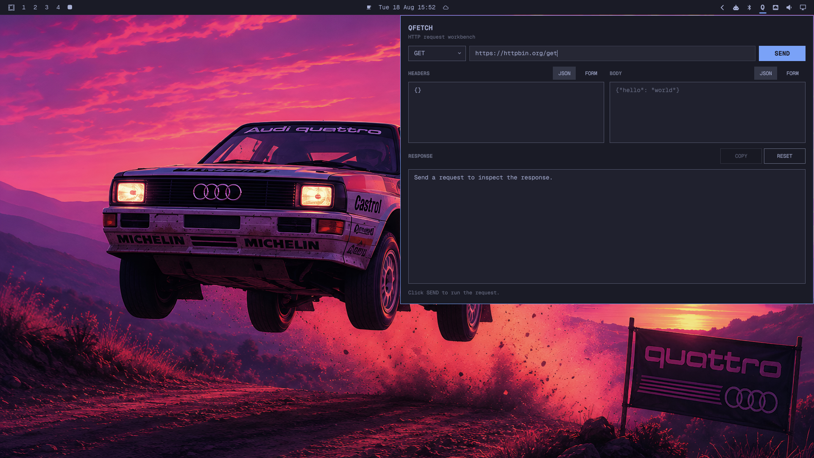

# QFetch

QFetch is a native Omarchy API client for making HTTP requests from the desktop shell.



## Features

- GET, POST, PUT, PATCH, DELETE and HEAD
- JSON and form editors for headers
- JSON and form editors for request bodies
- Form fields converted to JSON before sending
- Pretty-printed response bodies
- Response status, headers and elapsed time
- One-click response copying
- A `Q` button in the right side of the Omarchy bar
- Automatic panel dismissal when clicking outside or pressing `Escape`

## Install

Run this in a terminal:

```sh
omarchy plugin add https://github.com/znxr/QFetch.git --enable --yes
```

QFetch will be added to the right side of the bar. Click `Q` to open it.

## Use

1. Select an HTTP method.
2. Enter the request URL.
3. Choose `JSON` or `FORM` for headers and the body.
4. Enter the request data.
5. Click `SEND`.
6. Click `COPY` to copy the response body.

JSON mode accepts any valid JSON object. Form mode provides editable key/value rows and supports adding or removing fields.

The default request uses `https://httpbin.org/get`. Replace it before sending requests to another API.

## Open From Terminal

```sh
omarchy-shell shell summon io.github.znxr.qfetch '{}'
```

## Security

QFetch runs inside the existing `omarchy-shell` process with the permissions of the current user. It has no installer, service, external dependency or privilege requirement. Requests go directly to the URLs entered by the user. Do not paste secrets into requests unless the destination is trusted.

## Validate

```sh
PLUGIN_DIR="$HOME/.config/omarchy/plugins/io.github.znxr.qfetch"
omarchy plugin validate "$PLUGIN_DIR"
qmllint -I "$OMARCHY_PATH/shell" \
  "$PLUGIN_DIR/Panel.qml" "$PLUGIN_DIR/BarWidget.qml"
```

## Remove

```sh
omarchy plugin remove io.github.znxr.qfetch
```
